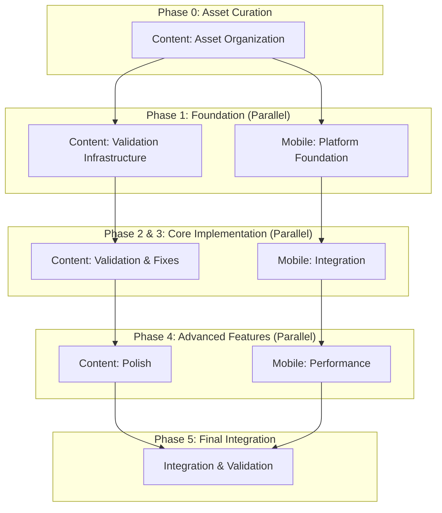

# Design Document: Master Orchestration

## Overview

This design orchestrates two major specs (Content and Mobile) with optimal parallelism while respecting dependencies. The orchestrator acts as a meta-agent that delegates to sub-specs, tracks progress across both, and ensures proper sequencing.

## Architecture



## Execution Strategy

### Phase Definitions

**Phase 0: Asset Curation (Sequential)**
- Content US-000: Audit and curate tileset assets
- Content US-001-NEW: Create organized asset structure
- Content US-002-NEW: Validate TMX/TSX compatibility
- Duration: ~3-5 tasks
- Blocks: Everything (must run first)

**Phase 1: Foundation (Parallel)**
- Content US-003-OLD to US-010-OLD (8 tasks)
- Mobile US-011-OLD to US-016-OLD (6 tasks)
- Duration: ~14 tasks total, ~8 tasks in parallel time
- Blocks: Phase 2 (Content), Phase 3 (Mobile)

**Phase 2: Content Validation (Sequential)**
- Content US-017-OLD to US-026-OLD (10 tasks)
- Duration: ~10 tasks
- Blocks: Phase 4 Content
- Can run parallel with: Phase 3

**Phase 3: Mobile Integration (Sequential)**
- Mobile US-027-OLD to US-034-OLD (8 tasks)
- Duration: ~8 tasks
- Blocks: Phase 4 Mobile
- Can run parallel with: Phase 2

**Phase 4: Advanced Features (Parallel)**
- Content US-035-OLD to US-038-OLD (4 tasks)
- Mobile US-039-OLD to US-041-OLD (3 tasks)
- Duration: ~7 tasks total, ~4 tasks in parallel time
- Blocks: Phase 5

**Phase 5: Final Integration (Sequential)**
- US-042-OLD to US-048-OLD (7 tasks)
- Duration: ~7 tasks
- Blocks: Nothing (final phase)

### Delegation Model

The orchestrator delegates to the actual spec task files:

```typescript
interface TaskDelegation {
  specName: 'content' | 'mobile';
  taskId: string;
  taskFile: string; // Path to tasks.md
  requirementsFile: string; // Path to requirements.md
  designFile: string; // Path to design.md
}
```

### Progress Tracking

The orchestrator maintains:
- `master-orchestration/progress.md` - Unified progress log
- `master-orchestration/specs_time.md` - Timing across both specs
- `master-orchestration/summary.html` - Combined dashboard

### Checkpoint Logic

```typescript
interface Checkpoint {
  phase: number;
  requiredTasks: string[];
  allComplete: boolean;
  failedTasks: string[];
}

function validateCheckpoint(phase: number): Checkpoint {
  const tasks = getTasksForPhase(phase);
  const statuses = tasks.map(t => getTaskStatus(t));
  
  return {
    phase,
    requiredTasks: tasks,
    allComplete: statuses.every(s => s === 'complete'),
    failedTasks: tasks.filter(t => getTaskStatus(t) === 'failed')
  };
}
```

## Task Mapping

### Phase 0: Asset Curation
```
- [ ] 1. Audit and curate tileset assets (US-000)
- [ ] 2. Create organized asset structure (US-001-NEW)
- [ ] 3. Validate TMX/TSX compatibility (US-002-NEW)
```

### Phase 1: Foundation (Parallel)
```
Content Stream:
- [ ] 4. Set up validation infrastructure (US-003-OLD)
- [ ] 5. Implement Visual Validator (US-004-OLD)
- [ ] 6. Implement Sprite Analyzer (US-005-OLD)
- [ ] 7. Implement Map Validator (US-006-OLD)
- [ ] 8. Implement Event Verifier (US-007-OLD)
- [ ] 9. Implement Content Validator (US-008-OLD)
- [ ] 10. Create Validation Orchestrator (US-009-OLD)
- [ ] 11. Create validation CLI (US-010-OLD)

Mobile Stream:
- [ ] 12. Set up project structure (US-011-OLD)
- [ ] 13. Implement platform detection (US-012-OLD)
- [ ] 14. Implement storage abstraction (US-013-OLD)
- [ ] 15. Implement SQLite provider (US-014-OLD)
- [ ] 16. Implement sql.js provider (US-015-OLD)
- [ ] 17. Implement haptics controller (US-016-OLD)
```

### Phase 2: Content Validation (Sequential)
```
- [ ] 18. Run initial validation (US-017-OLD)
- [ ] 19. Implement Enemy Implementer (US-018-OLD)
- [ ] 20. Implement missing enemies (US-019-OLD)
- [ ] 21. Validate enemies (US-020-OLD)
- [ ] 22. Fix visual consistency (US-021-OLD)
- [ ] 23. Verify visual fixes (US-022-OLD)
- [ ] 24. Fix event placement (US-023-OLD)
- [ ] 25. Verify events (US-024-OLD)
- [ ] 26. Fix content gaps (US-025-OLD)
- [ ] 27. Verify completeness (US-026-OLD)
```

### Phase 3: Mobile Integration (Sequential)
```
- [ ] 28. Initialize Capacitor (US-027-OLD)
- [ ] 29. Configure iOS (US-028-OLD)
- [ ] 30. Configure Android (US-029-OLD)
- [ ] 31. Validate configs (US-030-OLD)
- [ ] 32. Create PWA manifest (US-031-OLD)
- [ ] 33. Implement service worker (US-032-OLD)
- [ ] 34. Register service worker (US-033-OLD)
- [ ] 35. Verify PWA (US-034-OLD)
```

### Phase 4: Advanced Features (Parallel)
```
Content Stream:
- [ ] 36. Player journey init (US-035-OLD)
- [ ] 37. Validate puzzles (US-036-OLD)
- [ ] 38. Validate NPCs (US-037-OLD)
- [ ] 39. Validate dungeons (US-038-OLD)

Mobile Stream:
- [ ] 40. Network handling (US-039-OLD)
- [ ] 41. Performance optimization (US-040-OLD)
- [ ] 42. Touch controls (US-041-OLD)
```

### Phase 5: Final Integration (Sequential)
```
- [ ] 43. Integrate platform adapter (US-042-OLD)
- [ ] 44. Verify integrations (US-043-OLD)
- [ ] 45. Set up build pipeline (US-044-OLD)
- [ ] 46. Configure CI/CD (US-045-OLD)
- [ ] 47. Content final validation (US-046-OLD)
- [ ] 48. Content polish (US-047-OLD)
- [ ] 49. Mobile final builds (US-048-OLD)
```

## Delegation Implementation

### Task Execution

When executing a task, the orchestrator:

1. Determines which spec owns the task (Content or Mobile)
2. Reads the actual task from that spec's tasks.md
3. Reads requirements from that spec's requirements.md
4. Reads design from that spec's design.md
5. Executes the task following the spec's instructions
6. Updates both the spec's tasks.md AND the master tasks.md
7. Records progress in both locations

### Example Delegation

```markdown
Task 4: Set up validation infrastructure (US-003-OLD)

Delegates to:
- Spec: complete-game-content-and-creative-direction
- Task File: .kiro/specs/complete-game-content-and-creative-direction/tasks.md
- Task ID: Task 1 (Set up validation infrastructure and core utilities)
- Requirements: Requirements 20.1, 20.2
- Design: See validation infrastructure section

After completion:
- Mark complete in master-orchestration/tasks.md (Task 4)
- Mark complete in content spec tasks.md (Task 1)
- Record in both progress.md files
```

## Correctness Properties

### Property 1: Phase Ordering
For any two phases P1 and P2 where P2 depends on P1, P2 SHALL NOT start until all tasks in P1 are marked complete.

### Property 2: Parallel Independence
For any two tasks T1 and T2 running in parallel, completing T1 SHALL NOT affect the execution or correctness of T2.

### Property 3: Checkpoint Completeness
For any checkpoint C at the end of phase P, C SHALL pass if and only if all required tasks in P are marked complete.

### Property 4: Progress Consistency
For any task T marked complete in the master orchestration, T SHALL also be marked complete in its source spec.

### Property 5: Delegation Correctness
For any task T delegated to spec S, the implementation SHALL follow the requirements and design specified in S.

## Error Handling

### Failed Tasks
- If a task fails, mark it `[F]` in both master and spec tasks.md
- Stop the current phase
- Report which task failed and why
- Do not proceed to dependent phases

### Checkpoint Failures
- If a checkpoint fails, report all incomplete/failed tasks
- Provide guidance on how to fix
- Allow manual intervention
- Support resuming after fixes

### Parallel Execution Conflicts
- If two parallel tasks modify the same file, the second write wins
- Log a warning about potential conflicts
- Recommend reviewing the affected file

## Summary Generation

On completion, generate `master-orchestration/summary.html` with:

**Top Section:**
- Overall status (green if all complete, red if any failed)
- Total elapsed time across both specs
- Task counts: 49 total (3 Phase 0 + 14 Phase 1 + 10 Phase 2 + 8 Phase 3 + 7 Phase 4 + 7 Phase 5)
- Date range

**Phase Timeline:**
- Visual timeline showing phases
- Parallel execution visualization
- Duration per phase

**Spec Breakdown:**
- Content spec: 27 tasks
- Mobile spec: 22 tasks
- Links to individual spec summaries

**Task Tree:**
- Collapsible tree by phase
- Color-coded by spec (Content vs Mobile)
- Hover for details

**Timing Table:**
- All 49 tasks with durations
- Phase subtotals
- Parallel time savings calculation
