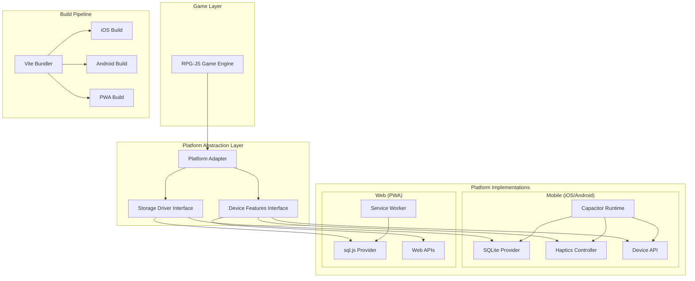

# Design Document: Mobile Deployment and PWA

## Overview

This design enables the RPG-JS v4 game to be deployed across three platforms: native iOS applications, native Android applications, and Progressive Web Apps (PWA). The solution wraps the existing Vite-based standalone build with Capacitor, providing a unified codebase that adapts to each platform's capabilities while maintaining functional equivalence across all deployment targets.

The architecture introduces a platform abstraction layer that detects the runtime environment and provides appropriate implementations for storage, device APIs, and platform-specific features like haptic feedback. The web build gains offline capabilities through service workers and PWA configuration, while mobile builds leverage native SQLite storage and device APIs for enhanced performance and user experience.

Key design principles:
- **Platform Agnostic Core**: The RPG-JS game engine remains unchanged; platform-specific code is isolated in adapters
- **Progressive Enhancement**: Features gracefully degrade on platforms that don't support them
- **Build Separation**: Each platform has independent build commands and configurations
- **Storage Abstraction**: A unified interface ensures data persistence works consistently across platforms
- **Offline First**: All platforms support offline gameplay through appropriate caching strategies

## Architecture

### High-Level Architecture



### Component Responsibilities

**Platform Adapter**
- Detects runtime environment (iOS, Android, web)
- Routes API calls to appropriate platform implementations
- Provides consistent interface to game engine
- Handles graceful degradation for unsupported features

**Storage Driver Interface**
- Defines abstract operations: save, load, update, delete
- Ensures type safety across implementations
- Manages serialization/deserialization
- Handles error propagation

**Device Features Interface**
- Abstracts haptic feedback, device info, and platform capabilities
- Provides no-op implementations for unsupported platforms
- Exposes platform detection to game logic

**Capacitor Runtime**
- Wraps web build in native WebView
- Bridges JavaScript to native APIs
- Manages app lifecycle events
- Handles native permissions

**Service Worker**
- Implements cache-first strategy for assets
- Manages offline availability
- Handles cache versioning and updates
- Provides offline fallback UI

## Components and Interfaces

### Platform Detection Module

```typescript
interface PlatformInfo {
  platform: 'ios' | 'android' | 'web';
  model: string;
  osVersion: string;
  isNative: boolean;
}

interface PlatformDetector {
  getPlatformInfo(): Promise<PlatformInfo>;
  isNative(): boolean;
  supportsHaptics(): boolean;
  supportsNativeStorage(): boolean;
}
```

**Implementation Strategy:**
- Use Capacitor's Device API when available
- Fall back to user agent parsing for web
- Cache detection results for performance
- Expose capabilities as boolean flags

### Storage Abstraction Layer

```typescript
interface GameData {
  playerId: string;
  saveSlot: number;
  data: Record<string, unknown>;
  timestamp: number;
}

interface StorageDriver {
  initialize(): Promise<void>;
  save(key: string, data: GameData): Promise<void>;
  load(key: string): Promise<GameData | null>;
  update(key: string, data: Partial<GameData>): Promise<void>;
  delete(key: string): Promise<void>;
  list(): Promise<string[]>;
  close(): Promise<void>;
}
```

**SQLite Provider (Mobile)**
- Uses `@capacitor-community/sqlite` plugin
- Implements schema versioning for migrations
- Stores data as JSON blobs in SQLite tables
- Handles connection pooling and cleanup

**sql.js Provider (Web)**
- Uses sql.js (SQLite compiled to WebAssembly)
- Persists database to IndexedDB
- Implements same interface as native SQLite
- Handles browser storage quota limits

**Implementation Notes:**
- Both providers implement identical interface
- Data serialization uses JSON for compatibility
- Error handling returns descriptive error objects
- Transactions ensure atomic operations

### Haptics Controller

```typescript
type HapticImpact = 'light' | 'medium' | 'heavy';

interface HapticsController {
  impact(style: HapticImpact): Promise<void>;
  notification(type: 'success' | 'warning' | 'error'): Promise<void>;
  vibrate(duration: number): Promise<void>;
  isAvailable(): boolean;
}
```

**Implementation:**
- Uses Capacitor Haptics API on mobile
- No-op implementation for web
- Checks availability before triggering
- Maps game events to appropriate haptic patterns

### Service Worker Configuration

**Caching Strategy:**
- **Cache First**: Game assets, sprites, maps, audio
- **Network First**: API calls, dynamic content
- **Stale While Revalidate**: Configuration files

**Cache Versioning:**
```typescript
const CACHE_VERSION = 'v1';
const CACHE_NAME = `mnemonic-realms-${CACHE_VERSION}`;

const CRITICAL_ASSETS = [
  '/',
  '/index.html',
  '/assets/main.js',
  '/assets/main.css',
  // Game engine files
  // Sprite sheets
  // Map data
];
```

**Update Strategy:**
- Service worker checks for updates on page load
- New version triggers cache invalidation
- User prompted to reload for updates
- Old caches cleaned up after successful update

### PWA Manifest

```json
{
  "name": "Mnemonic Realms",
  "short_name": "Mnemonic",
  "description": "An RPG adventure game",
  "start_url": "/",
  "display": "standalone",
  "background_color": "#000000",
  "theme_color": "#1a1a1a",
  "orientation": "landscape",
  "icons": [
    {
      "src": "/icons/icon-192.png",
      "sizes": "192x192",
      "type": "image/png"
    },
    {
      "src": "/icons/icon-512.png",
      "sizes": "512x512",
      "type": "image/png"
    }
  ]
}
```

## Data Models

### Storage Schema

**Game Save Table (SQLite/sql.js)**
```sql
CREATE TABLE IF NOT EXISTS game_saves (
  id TEXT PRIMARY KEY,
  player_id TEXT NOT NULL,
  save_slot INTEGER NOT NULL,
  data TEXT NOT NULL,  -- JSON blob
  created_at INTEGER NOT NULL,
  updated_at INTEGER NOT NULL,
  UNIQUE(player_id, save_slot)
);

CREATE INDEX idx_player_saves ON game_saves(player_id);
```

**Settings Table**
```sql
CREATE TABLE IF NOT EXISTS settings (
  key TEXT PRIMARY KEY,
  value TEXT NOT NULL,  -- JSON blob
  updated_at INTEGER NOT NULL
);
```

**Cache Metadata (IndexedDB for web)**
```typescript
interface CacheMetadata {
  version: string;
  timestamp: number;
  assets: {
    url: string;
    size: number;
    hash: string;
  }[];
}
```

### Platform Configuration

**Capacitor Configuration (capacitor.config.ts)**
```typescript
interface CapacitorConfig {
  appId: string;
  appName: string;
  webDir: string;
  server: {
    androidScheme: string;
    iosScheme: string;
  };
  plugins: {
    SplashScreen: {
      launchShowDuration: number;
      backgroundColor: string;
    };
    Keyboard: {
      resize: string;
    };
  };
}
```

**iOS Configuration (Info.plist keys)**
- `CFBundleDisplayName`: App display name
- `CFBundleIdentifier`: Bundle ID
- `CFBundleVersion`: Build number
- `CFBundleShortVersionString`: Version string
- `UIRequiresFullScreen`: Force fullscreen
- `UISupportedInterfaceOrientations`: Landscape only

**Android Configuration (AndroidManifest.xml)**
- `package`: Package name
- `versionCode`: Numeric version
- `versionName`: Version string
- `screenOrientation`: Landscape
- Permissions: INTERNET, WRITE_EXTERNAL_STORAGE (if needed)

### Build Artifacts

**Web Build Output (dist/standalone)**
- index.html
- assets/ (JS, CSS bundles)
- sprites/
- maps/
- audio/
- manifest.json
- service-worker.js

**iOS Build Output**
- ios/App/App.xcodeproj
- ios/App/App/Assets.xcassets
- Embedded web build in App bundle

**Android Build Output**
- android/app/build.gradle
- android/app/src/main/AndroidManifest.xml
- Embedded web build in assets/public


## Correctness Properties

A property is a characteristic or behavior that should hold true across all valid executions of a system—essentially, a formal statement about what the system should do. Properties serve as the bridge between human-readable specifications and machine-verifiable correctness guarantees.

### Property Reflection

After analyzing all acceptance criteria, I identified several areas of redundancy:

1. **Storage Persistence Properties (5.3, 6.4)**: Both test that data survives app/browser restart. These can be combined into a single property about the storage abstraction layer.

2. **Storage Round-Trip Properties (4.5, 5.2)**: Property 4.5 already covers the round-trip guarantee for all data types, making 5.2's specific data type testing redundant.

3. **Service Worker Caching Properties (8.1, 8.2, 8.3)**: These three properties all test caching behavior and can be consolidated into comprehensive caching properties.

4. **Platform-Specific Routing (4.2, 4.3, 5.1, 6.1)**: These are implementation details that don't need separate properties; they're covered by the storage abstraction interface property.

5. **Build Isolation (13.4)**: This property about platform-specific builds is important and stands alone.

6. **Cache Correctness (14.5)**: This is a critical property that ensures cached assets match network assets.

The following properties represent the unique, non-redundant correctness guarantees:

### Property 1: Cross-Platform Functional Equivalence

For any game feature that works correctly in the web build, the same feature shall work correctly in both iOS and Android native builds when tested with identical inputs and game state.

**Validates: Requirements 1.5**

### Property 2: Device Information Completeness

For any platform (iOS, Android, or web), the Device API shall return a PlatformInfo object containing non-empty values for platform, model, osVersion, and isNative fields.

**Validates: Requirements 2.2**

### Property 3: Haptics Graceful Degradation

For any platform that does not support haptics (web or unsupported devices), calling any haptics method (impact, notification, vibrate) shall complete without throwing errors or exceptions.

**Validates: Requirements 3.3**

### Property 4: Haptics Impact Types Support

For any haptic impact type (light, medium, heavy), calling the impact method on a haptics-supported platform shall execute without errors.

**Validates: Requirements 3.4**

### Property 5: Storage Write-Read Round Trip

For any valid GameData object written through the Storage Abstraction using the save method, reading it back using the load method shall return a GameData object that is deeply equal to the original.

**Validates: Requirements 4.5**

### Property 6: Storage Persistence Across Restarts

For any data saved through the Storage Abstraction before the application is closed, loading that data after the application is reopened shall return the same data that was saved.

**Validates: Requirements 5.3, 6.4**

### Property 7: Storage Schema Migration Safety

For any database schema migration from version N to version N+1, all data that existed before the migration shall remain accessible and unchanged after the migration completes.

**Validates: Requirements 5.4**

### Property 8: Storage Error Safety

For any storage operation that fails and returns an error, all data that existed before the operation shall remain unchanged and accessible.

**Validates: Requirements 5.5**

### Property 9: Storage Provider Interface Parity

For any operation defined in the StorageDriver interface (save, load, update, delete, list), both SQLite_Provider and Web_Storage_Provider shall implement that operation with the same method signature and return type.

**Validates: Requirements 6.5**

### Property 10: Essential Assets Caching

For any asset in the CRITICAL_ASSETS list, after the service worker completes its initial installation, that asset shall be present in the cache storage.

**Validates: Requirements 8.1**

### Property 11: Offline Asset Serving

For any cached asset, when the network is unavailable and that asset is requested, the service worker shall serve the cached version without network errors.

**Validates: Requirements 8.2**

### Property 12: Cache-First Strategy

For any game asset or runtime file, when that asset is requested, the service worker shall check the cache before making a network request.

**Validates: Requirements 8.3**

### Property 13: Cache Version Invalidation

For any cached asset, when the cache version changes from V1 to V2, the asset cached under V1 shall be removed and replaced with the V2 version.

**Validates: Requirements 8.4, 14.2**

### Property 14: Touch Debouncing

For any sequence of touch events where multiple touches occur within the debounce threshold (e.g., 100ms), only the first valid touch shall be processed by the game engine.

**Validates: Requirements 11.3**

### Property 15: Frame Rate Throttling

For any game state on mobile platforms, the measured frame rate shall not exceed the configured mobile frame rate limit (e.g., 60 FPS).

**Validates: Requirements 12.2**

### Property 16: Background Resource Reduction

For any measurable resource (CPU usage, frame rate, network requests), when the application transitions from foreground to background, that resource's usage shall decrease or cease.

**Validates: Requirements 12.3**

### Property 17: Memory Usage Bounds

For any game state on mobile platforms, the total memory usage shall not exceed the configured memory limit for mobile devices.

**Validates: Requirements 12.5**

### Property 18: Build Platform Isolation

For any platform-specific build command (build:ios, build:android, build:pwa), executing that command shall produce artifacts only for that specific platform and not for other platforms.

**Validates: Requirements 13.4**

### Property 19: Progressive Caching Non-Blocking

For any service worker installation, the initial page load shall complete and become interactive before all non-critical assets are cached.

**Validates: Requirements 14.4**

### Property 20: Cache Content Equivalence

For any asset URL, the content served from cache shall be byte-for-byte identical to the content served from the network for the same cache version.

**Validates: Requirements 14.5**

### Property 21: Offline Operation Continuity

For any game state, when network connectivity is lost, the game shall continue to operate using cached assets without throwing network-related errors.

**Validates: Requirements 15.1**

### Property 22: Network Retry Exponential Backoff

For any failed network request, subsequent retry attempts shall have exponentially increasing delays (e.g., 1s, 2s, 4s, 8s).

**Validates: Requirements 15.2**

### Property 23: Network Status Adaptation

For any network status change (online to offline, or offline to online), the game engine shall detect the change within a reasonable time window (e.g., 5 seconds) and adapt its behavior accordingly.

**Validates: Requirements 15.3**

### Property 24: Pending Operations Synchronization

For any data operation that was pending while offline, when network connectivity is restored, that operation shall be executed and completed successfully.

**Validates: Requirements 15.5**

## Error Handling

### Storage Errors

**Error Types:**
- `StorageInitializationError`: Database connection or initialization failed
- `StorageWriteError`: Save or update operation failed
- `StorageReadError`: Load operation failed
- `StorageDeleteError`: Delete operation failed
- `StorageMigrationError`: Schema migration failed

**Error Handling Strategy:**
- All storage operations return `Promise<T>` that can reject with typed errors
- Errors include descriptive messages and error codes
- Failed operations do not corrupt existing data (atomic operations)
- Retry logic with exponential backoff for transient errors
- User-facing error messages for unrecoverable errors

**Example Error Flow:**
```typescript
try {
  await storage.save('save-slot-1', gameData);
} catch (error) {
  if (error instanceof StorageWriteError) {
    // Log error details
    logger.error('Failed to save game', { error, gameData });
    
    // Retry with backoff
    await retryWithBackoff(() => storage.save('save-slot-1', gameData));
  }
}
```

### Network Errors

**Error Types:**
- `NetworkUnavailableError`: No network connectivity
- `NetworkTimeoutError`: Request exceeded timeout
- `NetworkServerError`: Server returned error response

**Error Handling Strategy:**
- Detect network status using Capacitor Network API or browser APIs
- Implement exponential backoff for failed requests
- Queue operations when offline, sync when online
- Provide user feedback for offline mode
- Gracefully degrade features that require network

**Retry Configuration:**
```typescript
const RETRY_CONFIG = {
  maxRetries: 5,
  initialDelay: 1000, // 1 second
  maxDelay: 32000,    // 32 seconds
  backoffMultiplier: 2
};
```

### Platform API Errors

**Error Types:**
- `PlatformNotSupportedError`: Feature not available on current platform
- `PermissionDeniedError`: User denied required permission
- `DeviceAPIError`: Native API call failed

**Error Handling Strategy:**
- Check feature availability before using platform APIs
- Provide fallback implementations for unsupported features
- Request permissions gracefully with user explanation
- Log platform-specific errors for debugging
- Never crash due to missing platform features

### Build Errors

**Error Types:**
- `BuildConfigurationError`: Invalid build configuration
- `AssetBundlingError`: Asset processing failed
- `PlatformBuildError`: Platform-specific build failed

**Error Handling Strategy:**
- Validate configuration before starting build
- Provide clear error messages with resolution steps
- Fail fast on configuration errors
- Log detailed build output for debugging
- Separate build failures by platform

## Testing Strategy

### Dual Testing Approach

This feature requires both unit testing and property-based testing to ensure comprehensive coverage:

**Unit Tests** focus on:
- Specific platform detection scenarios (iOS, Android, web)
- Build pipeline configuration validation
- Service worker installation and activation
- PWA manifest structure
- Platform-specific API integration examples
- Error handling for specific failure cases

**Property-Based Tests** focus on:
- Storage round-trip guarantees across all data types
- Cross-platform functional equivalence
- Cache correctness across all assets
- Network retry behavior across all failure scenarios
- Memory and performance bounds across all game states

### Property-Based Testing Configuration

**Framework Selection:**
- **JavaScript/TypeScript**: Use `fast-check` library for property-based testing
- **Integration**: Configure fast-check to run minimum 100 iterations per property
- **Tagging**: Each property test must reference its design document property

**Example Property Test Structure:**
```typescript
import fc from 'fast-check';

// Feature: mobile-deployment-and-pwa, Property 5: Storage Write-Read Round Trip
test('storage write-read round trip', async () => {
  await fc.assert(
    fc.asyncProperty(
      gameDataArbitrary(),
      async (gameData) => {
        const storage = await createStorageDriver();
        const key = `test-${gameData.playerId}-${gameData.saveSlot}`;
        
        await storage.save(key, gameData);
        const loaded = await storage.load(key);
        
        expect(loaded).toEqual(gameData);
      }
    ),
    { numRuns: 100 }
  );
});
```

**Arbitrary Generators:**
- `gameDataArbitrary()`: Generates random valid GameData objects
- `platformInfoArbitrary()`: Generates random platform configurations
- `assetUrlArbitrary()`: Generates random asset URLs
- `networkConditionArbitrary()`: Generates random network states

### Unit Testing Strategy

**Test Organization:**
- `tests/platform/detection.test.ts`: Platform detection unit tests
- `tests/storage/sqlite.test.ts`: SQLite provider unit tests
- `tests/storage/sqljs.test.ts`: sql.js provider unit tests
- `tests/pwa/service-worker.test.ts`: Service worker unit tests
- `tests/pwa/manifest.test.ts`: PWA manifest validation tests
- `tests/build/capacitor.test.ts`: Capacitor configuration tests
- `tests/haptics/controller.test.ts`: Haptics controller tests

**Testing Tools:**
- **Unit Testing**: Vitest (already in project)
- **E2E Testing**: Playwright (already in project) for cross-platform testing
- **Mobile Testing**: Capacitor's testing utilities for native API mocking
- **Service Worker Testing**: Workbox testing utilities

**Coverage Goals:**
- Unit test coverage: 80% minimum
- Property test coverage: All 24 properties implemented
- Integration test coverage: All platform combinations (iOS, Android, web)
- E2E test coverage: Critical user flows on each platform

### Testing Environments

**Web Testing:**
- Chrome, Firefox, Safari (desktop and mobile)
- PWA installation and offline mode
- Service worker caching and updates

**iOS Testing:**
- iOS Simulator for development
- Physical devices for final validation
- TestFlight for beta testing

**Android Testing:**
- Android Emulator for development
- Physical devices for final validation
- Internal testing track for beta testing

### Continuous Integration

**CI Pipeline:**
1. Run unit tests on all platforms
2. Run property-based tests (100 iterations each)
3. Build web, iOS, and Android artifacts
4. Run E2E tests on web build
5. Run integration tests on iOS simulator
6. Run integration tests on Android emulator
7. Generate coverage reports

**Build Validation:**
- Verify all three platforms build successfully
- Validate manifest.json structure
- Check service worker registration
- Verify Capacitor configuration
- Validate platform-specific configurations (Info.plist, AndroidManifest.xml)

